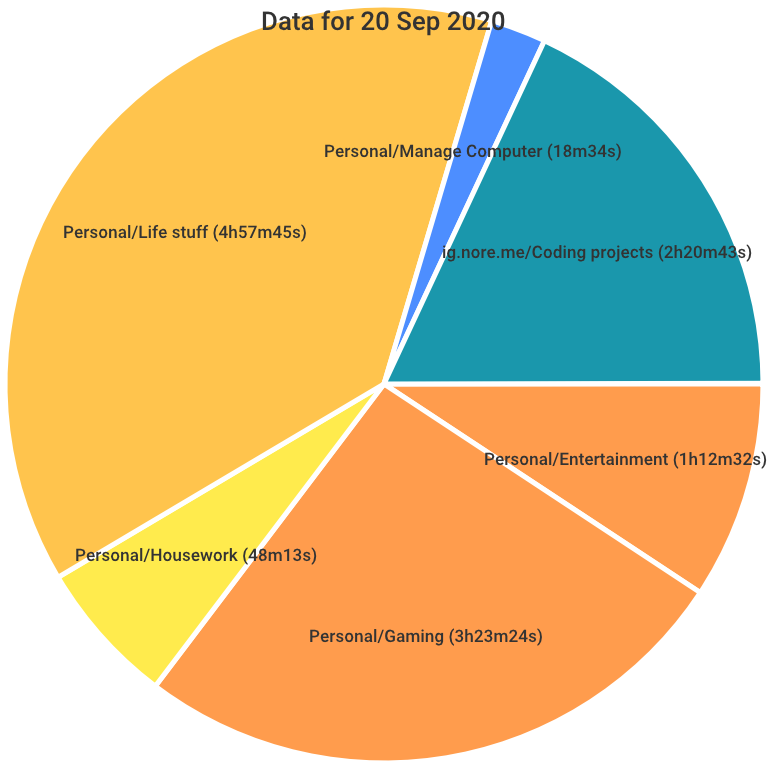

# Timing Overview

Timing Overview is a small Go function, runnable as a Lambda function or locally on your machine, that currently creates a pie chart of your activities during the provided time period as recorded [by Timing](https://timingapp.com).

I personally use the Lambda version to automatically insert this overview into my daily journal, as it gives a nice overview of what I've done that day.



## Usage

Current functionality is limited to creating an image of a pie chart for the provided period. There is no restriction on the length of this period.

### Local

If you want to run timing overview locally, you have the usual options:

* Download one of the [provided binaries](https://github.com/ArjenSchwarz/timing-overview/releases)
* Install using `go get -u github.com/ArjenSchwarz/timing-overview`
* Or download the repository and compile it yourself

Create a config.json file containing your API token:

```json
{
    "APIToken": "YOUR_SUPER_SECRET_API_TOKEN"
}
```

Run it:

```bash
$ timing-overview --startdate "2020-09-20 00:00" --enddate "2020-09-20 23:59"
```

This will use your local timezone to create an output.png image similar to the example above.

### Lambda/API Gateway

Alternatively, you can use the provided template to deploy it into your AWS environment. To do this, you will need to download the repository and deploy it using the Serverless Application Model (SAM) framework:

```bash
$ sam build
sam build
Building function 'TimingGraphAPIFunction'
Running GoModulesBuilder:Build

Build Succeeded
$ sam deploy --stack-name timing-overview --s3-bucket <<NAME OF YOUR BUCKET>> --capabilities CAPABILITY_NAMED_IAM
Deploying with following values
    ===============================
    Stack name                 : timing-overview
    Region                     : us-east-1
    Confirm changeset          : False
    Deployment s3 bucket       : <<NAME OF YOUR BUCKET>>
    Capabilities               : ["CAPABILITY_NAMED_IAM"]
    Parameter overrides        : {}

...
CloudFormation outputs from deployed stack
-------------------------------------------------------------------------------------------------------------------
Outputs
-------------------------------------------------------------------------------------------------------------------
Key                 Endpoint
Description         API Gateway endpoint URL for Prod environment
Value               https://abcdef123.execute-api.us-east-1.amazonaws.com/Prod/graph
-------------------------------------------------------------------------------------------------------------------
```

This assumes you have your Timing API Token stored in the parameter store as a secret value under the name `/timing/api-token`. If you use a different path, you can provide that as a parameter in your deploy command using `--parameter-overrides ApiTokenParameterPath=your/secret/path`.

The API Gateway endpoint is configured to use its own API key, so you will need to get the value for it and then you can call the function using POST and a small JSON document as payload:

```bash
$ curl -X "POST" "https://abcdef123.execute-api.us-east-1.amazonaws.com/Prod/graph" \
     -H 'x-api-key: mysupersecretkey' \
     -H 'Content-Type: application/json; charset=utf-8' \
     -d $'{
  "end_date": "2020-09-20 23:59 +1000",
  "start_date": "2020-09-20 00:00 +1000"
}' -o output.png
```

You will notice the provided dates are a bit different as they include the timezone (in my case, that is currently +1000). This is because Lambda always runs on UTC so using the local timezone will not work.

## Todo

[ ] Break out the SDK into its own repo so it can be reused for other uses.
[ ] Add some other endpoints
[ ] Give the CLI version a help functionality
[x] See if I can autodetect whether it's Lambda or local so the flag isn't needed anymore (thanks [@sktan](https://github.com/sktan))
[ ] Provide proper default values (today) for the CLI version
[ ] Handle no results situations properly
